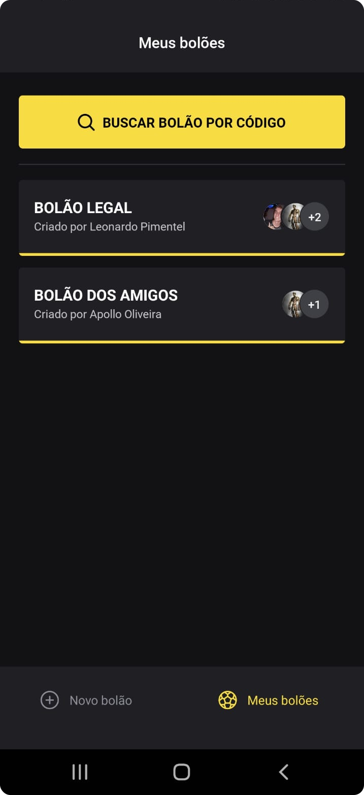

  

## 📃 Sobre

NLW Copa é o projeto desenvolvido durante a NLW(Next Level Week), um evento organizado pela Rocketseat.

## 💻 Projeto

Esse projeto consiste em uma aplicação com temática da copa, tem como objetivo o desenvolvimento de uma plataforma para que os usuários possam criar bolões e palpites para a copa do mundo de 2022. A aplicação mobile é onde se concentram todas as funcionalidades da plataforma, login, entrar em bolões, fazer palpites, compartilhamento de bolões e entre outros.

## 📱 Preview

    
    
    
    
    

## 📌 Tecnologias

- [Typescript](https://www.typescriptlang.org/docs/)
- [React Native](https://reactnative.dev/)
- [Native Base](https://nativebase.io/)
- [Axios](https://axios-http.com/)
- [Expo](https://expo.dev/)
